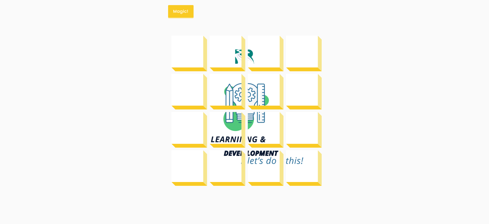

# 3D Background Boxes

Small JavaScript project that will display a GIF as a full size box and when the
Magic button is clicked, magic happens!

## Usage

The purpose of this project was to create a fun little component to display an
image/video in a different way

## Tech Stack

**Client:** HTML5, CSS3, JavaScript

## Authors

- [@haylzrandom](https://www.github.com/haylzrandom)

## Demo

## Screenshots

## Roadmap

- [ ] Allow user to input link to their own GIF
- [ ] Allow user to change colour of boxes

## License

[MIT](https://choosealicense.com/licenses/mit/)
