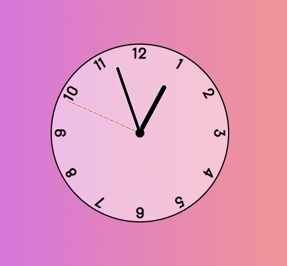

# Analogue Clock

Small JavaScript project to build a simple analogue clock!

## Usage

The purpose of this project was to create a a basic analogue clock using HTML, CSS and JavaScript

## Tech Stack

**Client:** HTML5, CSS3, JavaScript

## Authors

- [@haylzrandom](https://www.github.com/haylzrandom)

## Demo

## Screenshots

## License

[MIT](https://choosealicense.com/licenses/mit/)
