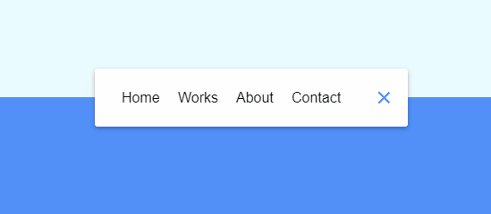

# Animated Navigation

Small JavaScript project that adds animation to a traditional burger style
navigation!

## Usage

The purpose of this project was to create a fun little component to test out
different ways of implementing a navigation

## Tech Stack

**Client:** HTML5, CSS3, JavaScript

## Authors

- [@haylzrandom](https://www.github.com/haylzrandom)

## Demo

## Screenshots

## License

[MIT](https://choosealicense.com/licenses/mit/)
