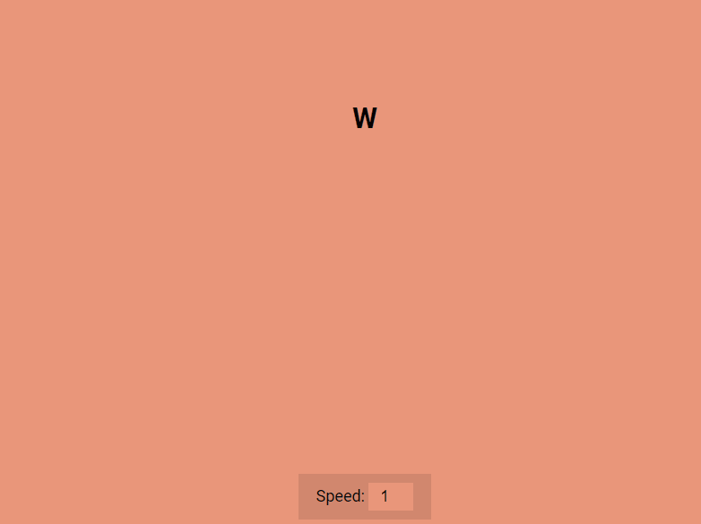

# Auto Text Effect

Small JavaScript project that type out a message like a typewrite. A user can
speed up or slow down the speed the typing occurs

## Usage

The purpose of this project was to create a fun little component to type out a
line of text in a unique design

## Tech Stack

**Client:** HTML5, CSS3, JavaScript

## Authors

- [@haylzrandom](https://www.github.com/haylzrandom)

## Demo

## Screenshots

## Roadmap

- [ ] Allow user to input their own text

## License

[MIT](https://choosealicense.com/licenses/mit/)
