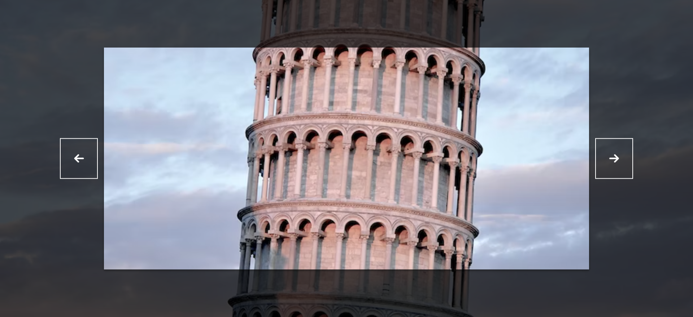

# Background Slider

Small JavaScript project that will display a range of images and allows a user
to click through.

## Usage

The purpose of this project was to create a a component that could be used as an
alternative to an image carousel

## Tech Stack

**Client:** HTML5, CSS3, JavaScript, Font Awesome

## Authors

- [@haylzrandom](https://www.github.com/haylzrandom)

## Demo

## Screenshots

## License

[MIT](https://choosealicense.com/licenses/mit/)
