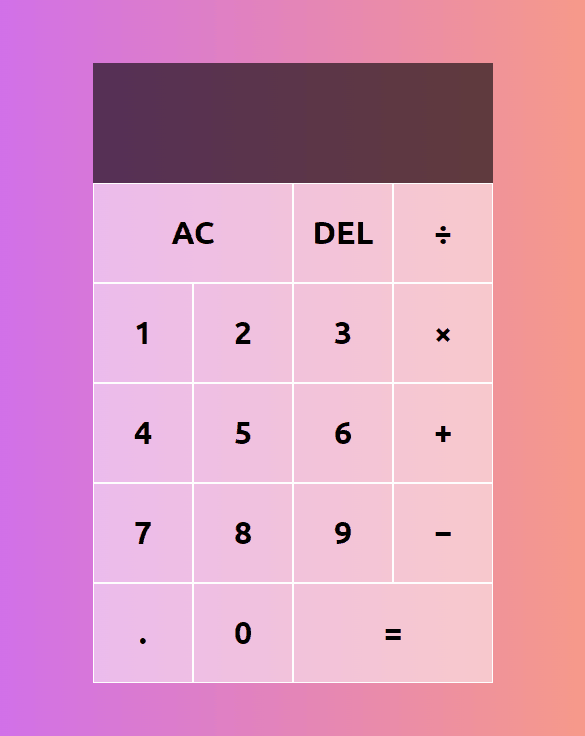

# Basic Calculator

Small JavaScript project to build a basic working calculator!

## Usage

The purpose of this project was to create a basic calculator that can add,
subtract, multiply and divide number selected

## Tech Stack

**Client:** HTML5, CSS3, JavaScript

## Authors

- [@haylzrandom](https://www.github.com/haylzrandom)

## Demo

## Screenshots

## License

[MIT](https://choosealicense.com/licenses/mit/)
