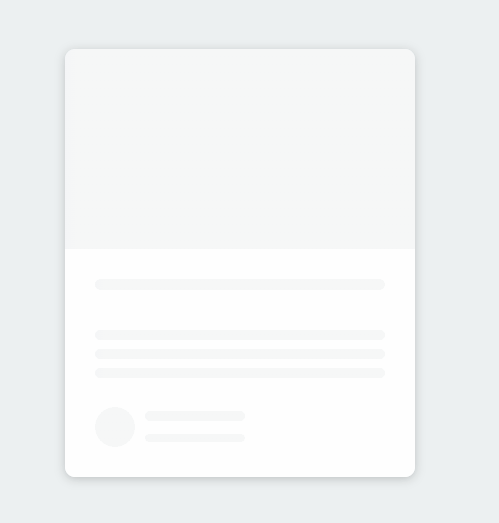

# Content Placeholder

Small JavaScript project that display a placeholder over the article will
loading the content

## Usage

The purpose of this project was to create styling that can be used for loading
an article (from an API for example)

## Tech Stack

**Client:** HTML5, CSS3, JavaScript

## Authors

- [@haylzrandom](https://www.github.com/haylzrandom)

## Demo

## Screenshots

## License

[MIT](https://choosealicense.com/licenses/mit/)
