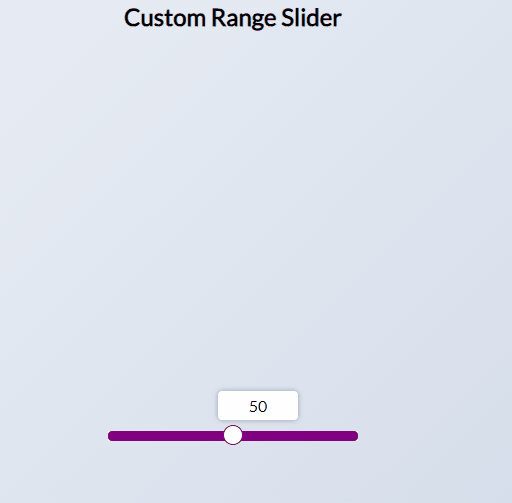

# Custom Range Slider

Small JavaScript project that will display custom range slider from 0 to 100

## Usage

The purpose of this project was to create a component that can be utilised when
needed on a website

## Tech Stack

**Client:** HTML5, CSS3, JavaScript

## Authors

- [@haylzrandom](https://www.github.com/haylzrandom)

## Demo

## Screenshots

## License

[MIT](https://choosealicense.com/licenses/mit/)
