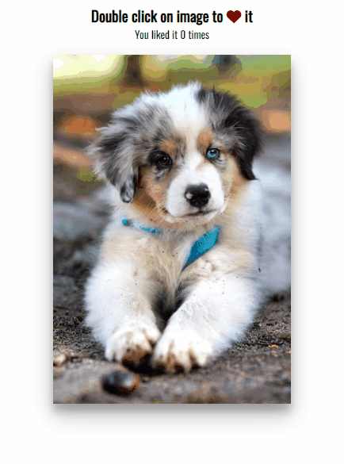

# Double Heart Click

Small JavaScript project that when a user clicks on the image they can heart it
over and over!

## Usage

The purpose of this project was to create a fun little component inspired by
Instagram that allows a user to like/heart the picture by clicking on it

## Tech Stack

**Client:** HTML5, CSS3, JavaScript, Font Awesome

## Authors

- [@haylzrandom](https://www.github.com/haylzrandom)

## Demo

## Screenshots

## License

[MIT](https://choosealicense.com/licenses/mit/)
