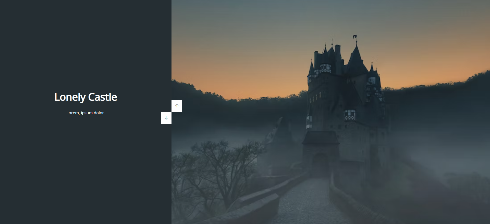

# Double Vertical Slider

Small JavaScript project that provides a way to navigate a website of images
vertically

## Usage

The purpose of this project was to create a different way to navigate a website
of images such as a tourism website

## Tech Stack

**Client:** HTML5, CSS3, JavaScript, Font Awesome

## Authors

- [@haylzrandom](https://www.github.com/haylzrandom)

## Demo

## Screenshots

## License

[MIT](https://choosealicense.com/licenses/mit/)
