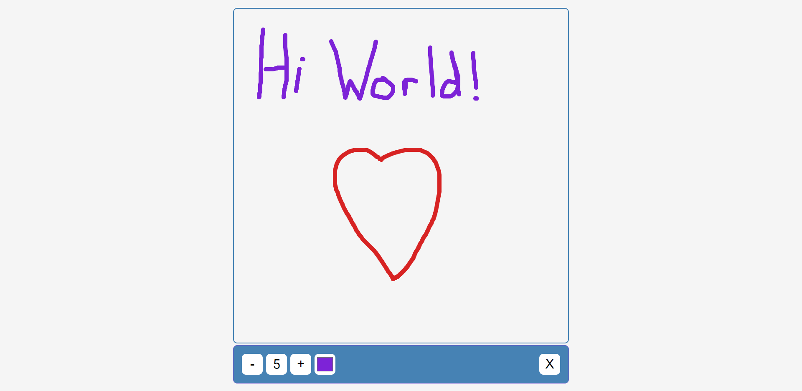

# Drawing App

Small JavaScript project that allows a user to draw on a canvas

## Usage

The purpose of this project was to utilise the Canvas API to allow a user to
draw on the website

## Tech Stack

**Client:** HTML5, CSS3, JavaScript

## Authors

- [@haylzrandom](https://www.github.com/haylzrandom)

## Demo

## Screenshots

## License

[MIT](https://choosealicense.com/licenses/mit/)
