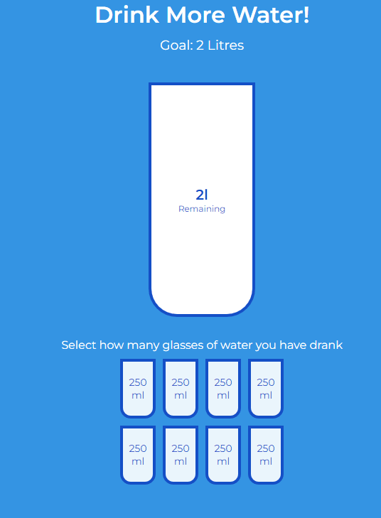
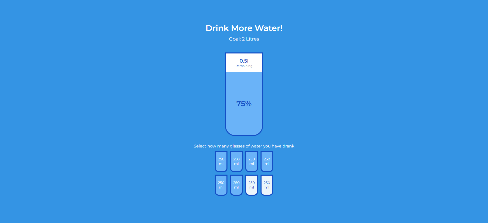

# Drink More Water

Small JavaScript project that will allow a user to track how much of their daily
water intake they have fulfilled

## Usage

The purpose of this project was to create a way to track how much the user has
drank and if they have met their daily target

## Tech Stack

**Client:** HTML5, CSS3, JavaScript

## Authors

- [@haylzrandom](https://www.github.com/haylzrandom)

## Demo

## Screenshots

## License

[MIT](https://choosealicense.com/licenses/mit/)
