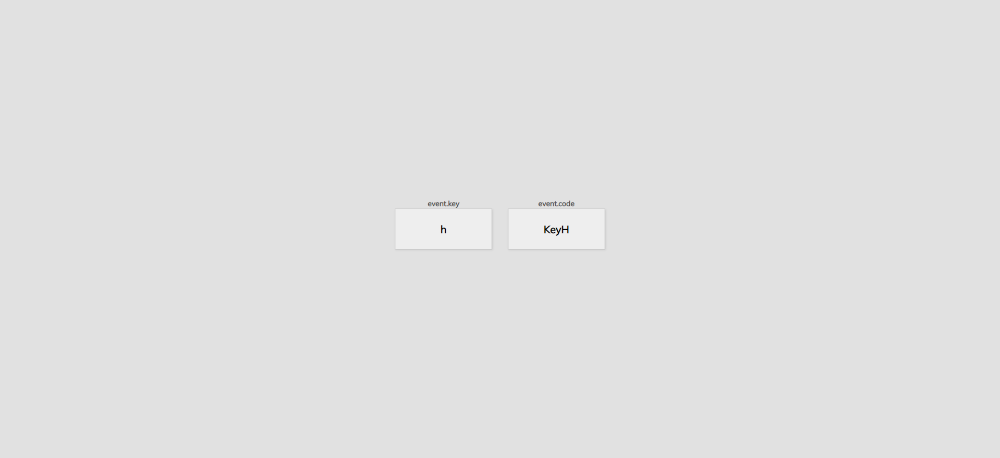

# Event Keycodes

Small JavaScript project that when a key on a keyboard is click it will show the
relevant key and code

## Usage

The purpose of this project was to experiment with Keyboard Events so they could
be utilised in a project further down the line

## Tech Stack

**Client:** HTML5, CSS3, JavaScript

## Authors

- [@haylzrandom](https://www.github.com/haylzrandom)

## Demo

## Screenshots

## License

[MIT](https://choosealicense.com/licenses/mit/)
