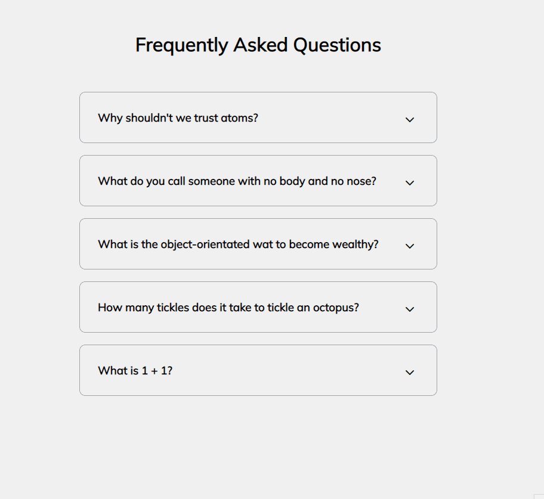

# 3D Background Boxes

Small JavaScript project that builds a FAQ accordion style component that is
often found on websites

## Usage

The purpose of this project was to create a component that could be utilised for
a FAQ section

## Tech Stack

**Client:** HTML5, CSS3, JavaScript, Font Awesome

## Authors

- [@haylzrandom](https://www.github.com/haylzrandom)

## Demo

## Screenshots

## License

[MIT](https://choosealicense.com/licenses/mit/)
