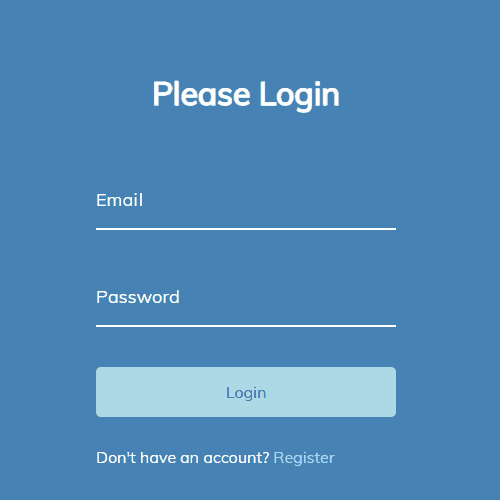

# Form Wave Animation

Small JavaScript project that adds animation and styling to a basic login form

## Usage

The purpose of this project was to create some different styling for a login
form that can be utilised in a website

## Tech Stack

**Client:** HTML5, CSS3, JavaScript

## Authors

- [@haylzrandom](https://www.github.com/haylzrandom)

## Demo

## Screenshots

## License

[MIT](https://choosealicense.com/licenses/mit/)
