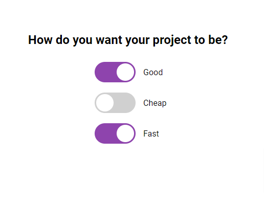

# Good, Cheap and Fast Checkboxes

Small JavaScript project that displays checkboxes as toggles and will explain how to set up your project

## Usage

The purpose of this project was to decorate checkboxes as stylish checkboxes and utilises JavaScript to figure out how to make a project wokr

## Tech Stack

**Client:** HTML5, CSS3, JavaScript

## Authors

- [@haylzrandom](https://www.github.com/haylzrandom)

## Demo

## Screenshots

## License

[MIT](https://choosealicense.com/licenses/mit/)
