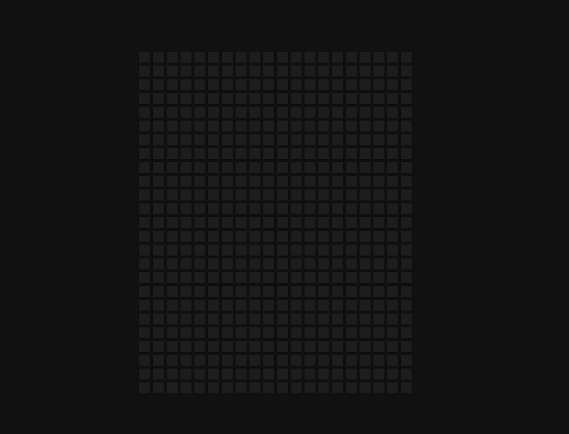
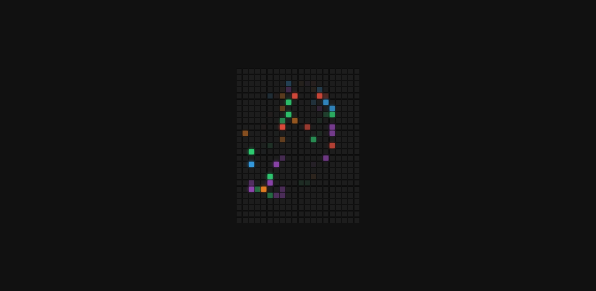

# Hoverboard

Small JavaScript project that will display a colour while hovering over the
screen with a cool effect

## Usage

The purpose of this project was to create a fun little component that when the
screen is hovered over a trail of colours will appear

## Tech Stack

**Client:** HTML5, CSS3, JavaScript

## Authors

- [@haylzrandom](https://www.github.com/haylzrandom)

## Demo

## Screenshots

## License

[MIT](https://choosealicense.com/licenses/mit/)
