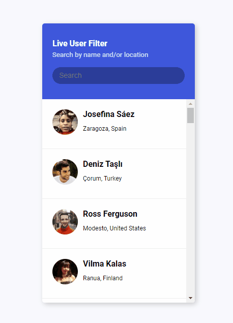

# Live User Filter

Small JavaScript project that will allow a user to search for a term and it will
match with either name or location of user

## Usage

The purpose of this project was to create a component that utilises Random User
API that when typing in letters it will filter down the list until it can match
a name or location of a user

## Tech Stack

**Client:** HTML5, CSS3, JavaScript,
[RandomUser API]('https://randomuser.me/api')

## Authors

- [@haylzrandom](https://www.github.com/haylzrandom)

## Demo

## Screenshots

## License

[MIT](https://choosealicense.com/licenses/mit/)
