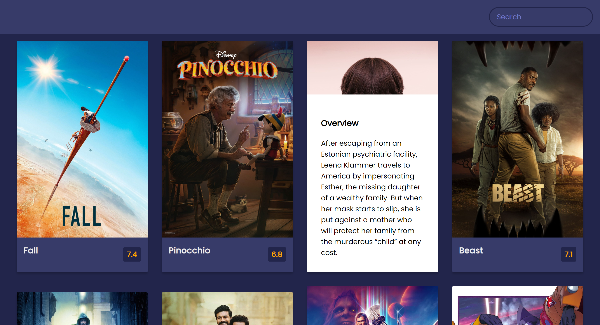

# Movie App

Small JavaScript project that will allow a user to search for a movie and look
at a movie overview and rating

## Usage

The purpose of this project was to utilise TheMovieDB API to display a
collection of movies with an overview and rating but also to allow a user to
search for movies

## Tech Stack

**Client:** HTML5, CSS3, JavaScript,
[TheMovieDB API]('https://api.themoviedb.org')

## Authors

- [@haylzrandom](https://www.github.com/haylzrandom)

## Demo

## Screenshots

## License

[MIT](https://choosealicense.com/licenses/mit/)
