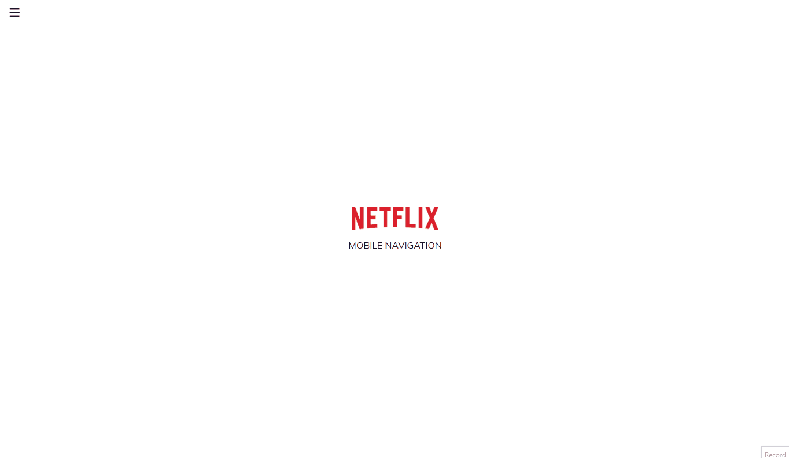

# Netflix Navigation

Small JavaScript project based on Netflix natvigation from a time ago

## Usage

The purpose of this project was recreate the mobile navigation of the Netflix
company homepage from a time ago

## Tech Stack

**Client:** HTML5, CSS3, JavaScript

## Authors

- [@haylzrandom](https://www.github.com/haylzrandom)

## Demo

## Screenshots

## License

[MIT](https://choosealicense.com/licenses/mit/)
