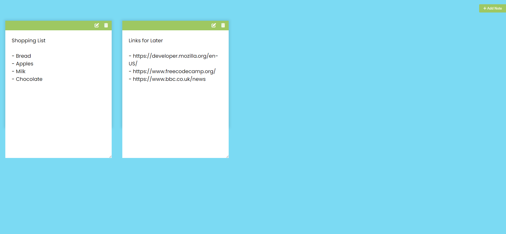

# Notes App

Small JavaScript project of a todo app that you can create notes

## Usage

The purpose of this project was to create a todo app that a user can add notes,
edit notes, delete notes and they will be saved into local storage for use later

## Tech Stack

**Client:** HTML5, CSS3, JavaScript

## Authors

- [@haylzrandom](https://www.github.com/haylzrandom)

## Demo

## Screenshots

## License

[MIT](https://choosealicense.com/licenses/mit/)
