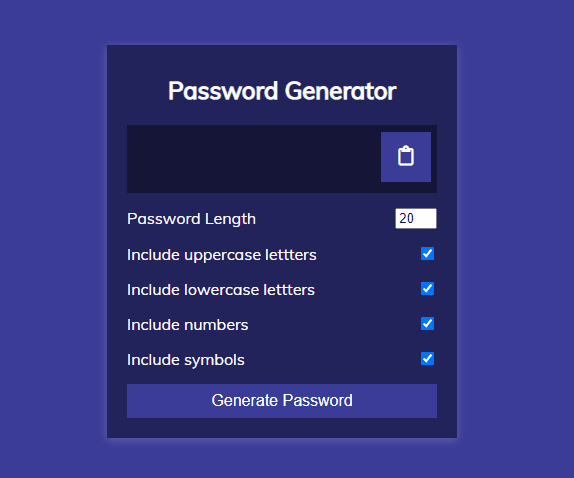

# Password Generator

Small JavaScript project that will allow a user to generate a password from
different options and copy to their clipboard

## Usage

The purpose of this project was to create a component that will allow a user to
select a number of options to generate a password and will also allow a user to
copy the password to their clipboard

## Tech Stack

**Client:** HTML5, CSS3, JavaScript

## Authors

- [@haylzrandom](https://www.github.com/haylzrandom)

## Demo

## Screenshots

## License

[MIT](https://choosealicense.com/licenses/mit/)
