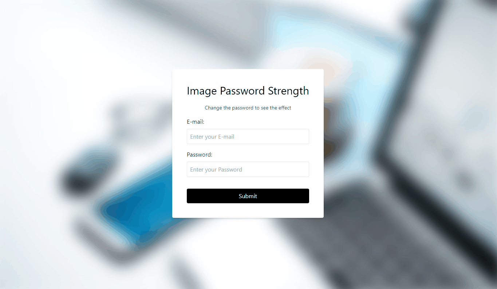

# Password Strength Background

Small JavaScript project that as you type a password, the longer the password
the clearer the background!

## Usage

The purpose of this project was to create a fun way to test password strength.
At present any password can be entered as long as it is 10 or more characters

## Tech Stack

**Client:** HTML5, CSS3, JavaScript

## Authors

- [@haylzrandom](https://www.github.com/haylzrandom)

## Demo

## Screenshots

## License

[MIT](https://choosealicense.com/licenses/mit/)
