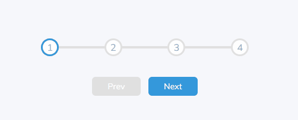
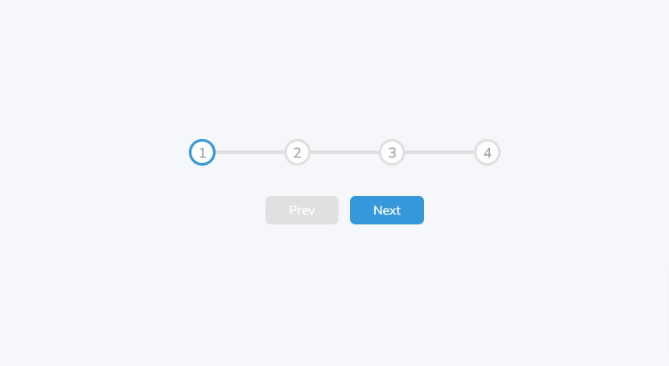

# Progress Steps

Small JavaScript project that when buttons are clicked it will progress to the
next step or retract to the previous step

## Usage

The purpose of this project was to create a component that can be utilised
alongside a form to indicate the progression

## Tech Stack

**Client:** HTML5, CSS3, JavaScript

## Authors

- [@haylzrandom](https://www.github.com/haylzrandom)

## Demo

## Screenshots

## License

[MIT](https://choosealicense.com/licenses/mit/)
