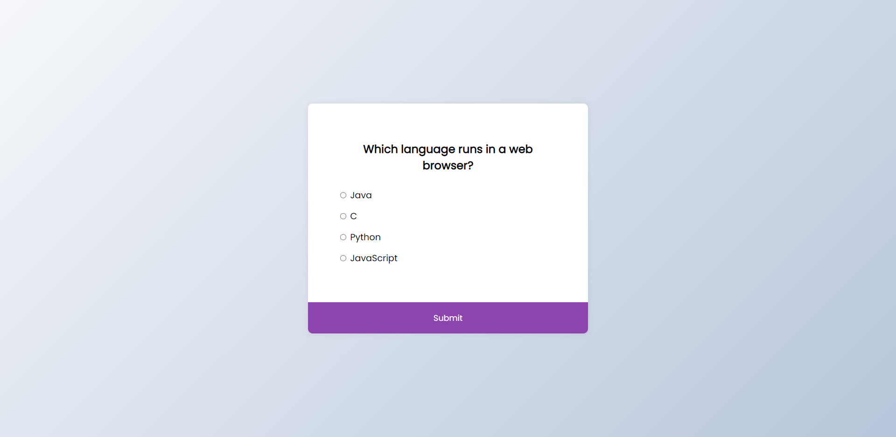

# Quiz App

Small JavaScript project that will ask user questions and give them their result
at the end

## Usage

The purpose of this project was to create a component that will display
questions and once completed display the result at the end

## Tech Stack

**Client:** HTML5, CSS3, JavaScript

## Authors

- [@haylzrandom](https://www.github.com/haylzrandom)

## Screenshots

## License

[MIT](https://choosealicense.com/licenses/mit/)
