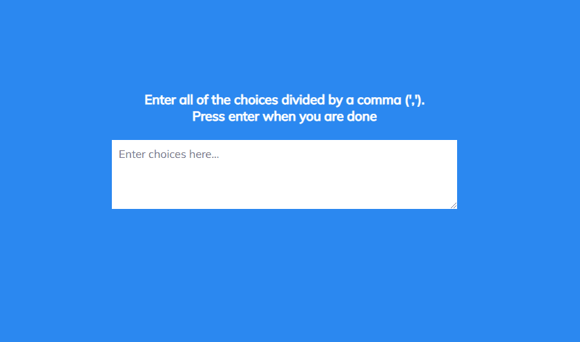

# Random Choice Picker

Small JavaScript project where a user can input various choices and the app will
choose a choice for them!

## Usage

The purpose of this project was to create a component that takes in multiple
choice and will randomly decide on a choice for a user

## Tech Stack

**Client:** HTML5, CSS3, JavaScript

## Authors

- [@haylzrandom](https://www.github.com/haylzrandom)

## Demo

## Screenshots

## License

[MIT](https://choosealicense.com/licenses/mit/)
