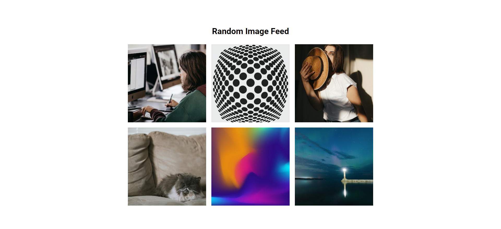

# Random Image Feed

Small JavaScript project that will display a random selection of images from
Unsplash API

## Usage

The purpose of this project was to create a component that will on load choose
different images from Unsplash and display them

## Tech Stack

**Client:** HTML5, CSS3, JavaScript, [Unsplash API](https://unsplash.com)

## Authors

- [@haylzrandom](https://www.github.com/haylzrandom)

## Screenshots

## License

[MIT](https://choosealicense.com/licenses/mit/)
