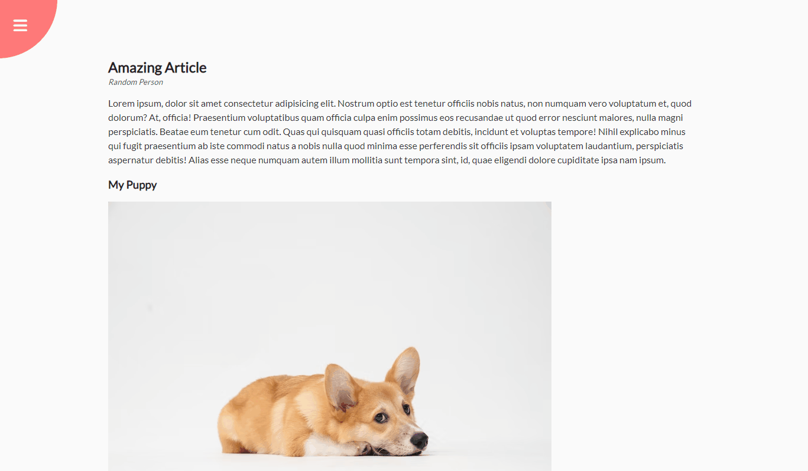

# Rotating Navigation

Small JavaScript project to style a different way of a navigation

## Usage

The purpose of this project was to create a fun way of making the site
navigation appear on screen

## Tech Stack

**Client:** HTML5, CSS3, JavaScript

## Authors

- [@haylzrandom](https://www.github.com/haylzrandom)

## Demo

## Screenshots

## License

[MIT](https://choosealicense.com/licenses/mit/)
