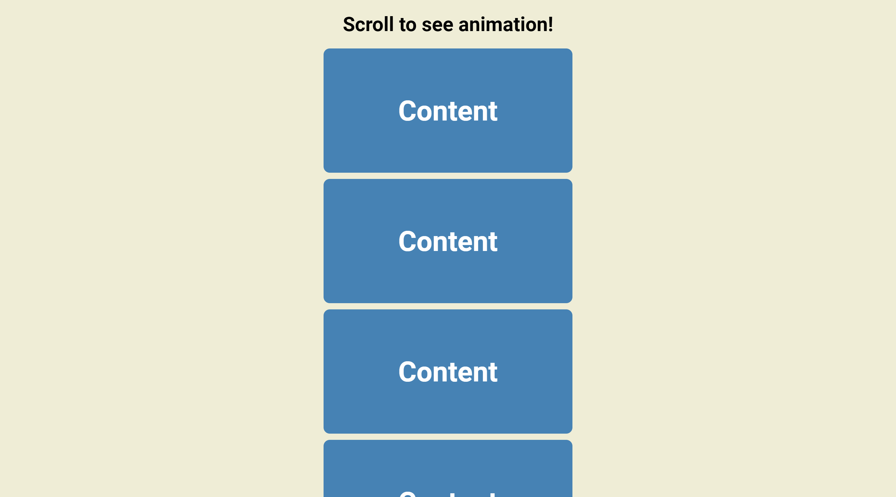

# Scroll Animation

Small JavaScript project that animates the content to fly in from left and right
of page as scrolling down the page

## Usage

The purpose of this project was to create an interesting way of getting content
to appear on screen

## Tech Stack

**Client:** HTML5, CSS3, JavaScript

## Authors

- [@haylzrandom](https://www.github.com/haylzrandom)

## Demo

## Screenshots

## License

[MIT](https://choosealicense.com/licenses/mit/)
