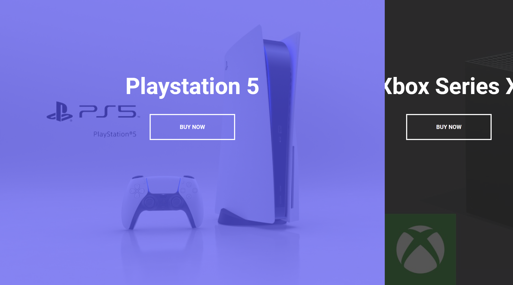

# Split Landing Page

Small JavaScript project that shows a landing page in a different way

## Usage

The purpose of this project was to create a different way to showcase two
products on a landing page

## Tech Stack

**Client:** HTML5, CSS3, JavaScript

## Authors

- [@haylzrandom](https://www.github.com/haylzrandom)

## Demo

## Screenshots

## License

[MIT](https://choosealicense.com/licenses/mit/)
