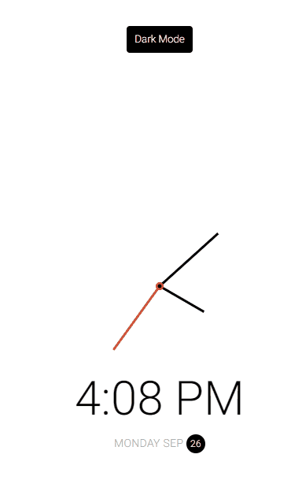
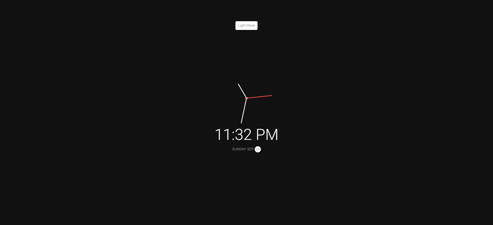

# Theme Clock

Small JavaScript project that displays the current time and date and allows user
to choose light/dark mode

## Usage

The purpose of this project was to create a component that will display the
local time, date and will also allow a user to choose between light and dark
mode

## Tech Stack

**Client:** HTML5, CSS3, JavaScript

## Authors

- [@haylzrandom](https://www.github.com/haylzrandom)

## Demo

## Screenshots

# Roadmap

- [ ] Auto set colour theme to user system settings

## License

[MIT](https://choosealicense.com/licenses/mit/)
