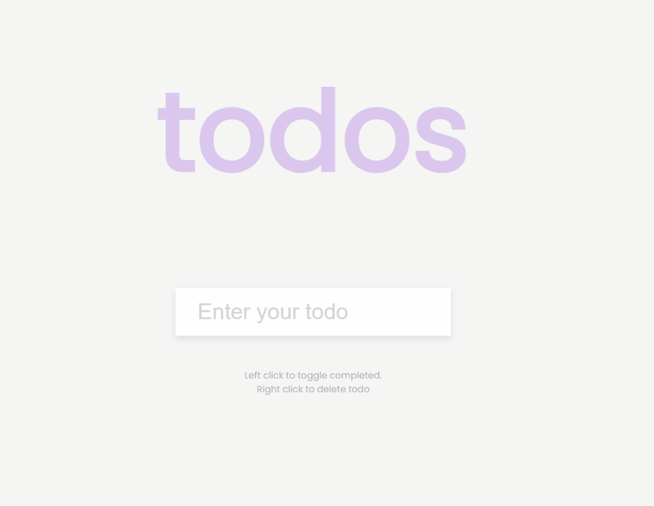

# To Do List

Small JavaScript project that will allow a user to create a todo list and
complete and delete todos

## Usage

The purpose of this project was to create a To Do app that will store the list
of todos in local storage

## Tech Stack

**Client:** HTML5, CSS3, JavaScript

## Authors

- [@haylzrandom](https://www.github.com/haylzrandom)

## Demo

## Screenshots

## License

[MIT](https://choosealicense.com/licenses/mit/)
