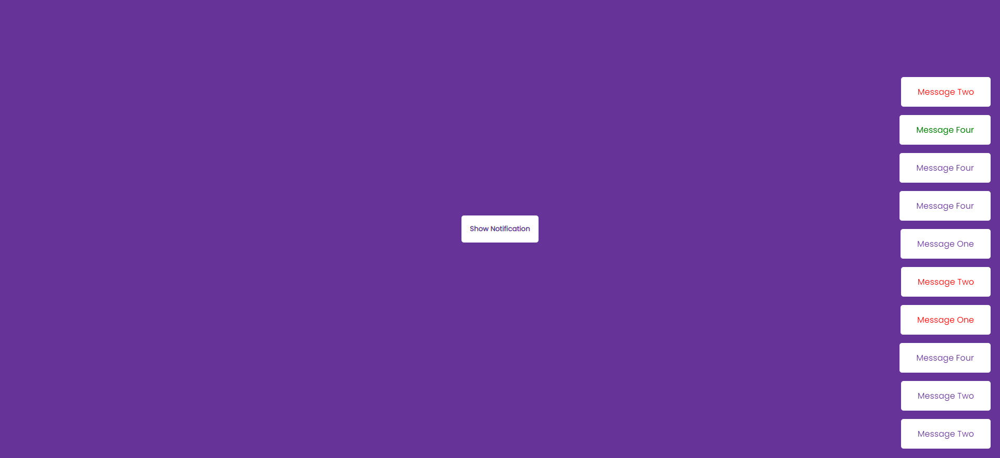

# Toast Notifications

Small JavaScript project that when button is clicked a toast notification will
pop up in the corner!

## Usage

The purpose of this project was to recreate toast notifications from
[React Toastify](https://fkhadra.github.io/react-toastify/introduction)

## Tech Stack

**Client:** HTML5, CSS3, JavaScript

## Authors

- [@haylzrandom](https://www.github.com/haylzrandom)

## Demo

## Screenshots

## License

[MIT](https://choosealicense.com/licenses/mit/)
