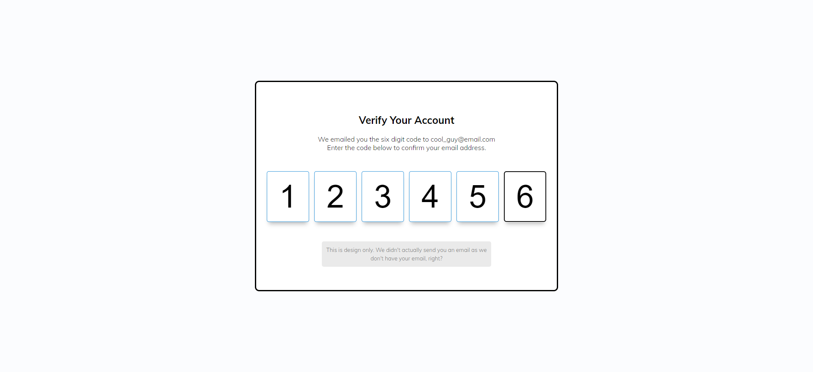

# Verify Account UI

Small JavaScript project that provides a UI for 2-Factor Authentication

## Usage

The purpose of this project was to create a UI to be used with 2-Factor
Authentication system

## Tech Stack

**Client:** HTML5, CSS3, JavaScript

## Authors

- [@haylzrandom](https://www.github.com/haylzrandom)

## Screenshots

## License

[MIT](https://choosealicense.com/licenses/mit/)
